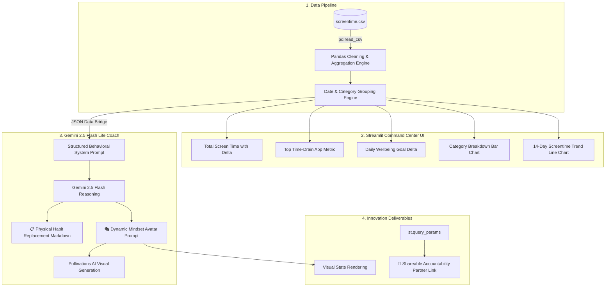

# 🌱 Life-OS: Digital Wellbeing & Habit Reclaiming Dashboard

> **MirAI School of Technology — Virtual Summer Internship 2026: AI Builder Track**  
> *Assignment 7: The "Life-OS" Wellbeing Dashboard*

---

## 📌 Project Overview

**Life-OS** is an intelligent digital wellbeing telemetry dashboard built with **Streamlit**, **Pandas**, and **Google Gemini 2.5 Flash**. It ingests daily device usage datasets, visualizes behavioral screen time patterns, computes goal variance metrics with inverse deltas, and delivers holistic AI coaching proposing tangible physical world replacement habits (workouts, meal prepping, tactile hobbies) alongside dynamic AI-generated mind-state avatars.

---

## 🏗️ Architecture & Pipeline



---

## ✨ Features Implemented

### Phase 1: The Data Pipeline
- **Dataset (`screentime.csv`)**: 14+ days of realistic usage telemetry containing `Date`, `App_Name`, `Category` (*Social Media*, *Coding*, *Education*, *Entertainment*, *Productivity*), and `Minutes_Used`.
- **Cached Ingestion**: High-speed caching via `@st.cache_data` and date standardisation.

### Phase 2: Command Center UI
- **Interactive Sidebar Controls**: `st.selectbox` for date filtering and `st.slider` for daily maximum screen time thresholds.
- **High-Impact KPI Row**:
  - `st.metric` for total daily time with inverse color-coded deltas.
  - `st.metric` for top time-draining app and category.
  - `st.metric` for goal compliance status.
- **Data Visualizations**: `st.bar_chart` for category splits and `st.line_chart` for 14-day longitudinal trends.

### Phase 3: AI Holistic Life Coach
- **Data Bridge**: Serializes tabular usage into a structured JSON string.
- **Gemini 2.5 Flash Integration**: Structured system prompt enforcing concrete real-world physical habit alternatives rather than generic advice.
- **Contextual Alerting**: Dynamic `st.error`, `st.warning`, and `st.success` banners depending on screen time severity.

### Phase 4: Innovation Deliverable (Included 2 Hidden Gems!)
1. **The Dynamic Mindset Avatar Engine**: Gemini analyzes the severity of daily habits and generates a cinematic avatar prompt, rendered live via Pollinations AI.
2. **Shareable Accountability Link**: Uses `st.query_params` to write daily telemetry into the browser URL so users can share their progress with an accountability partner.

---

## 🛠️ Setup & Running Locally

### 1. Prerequisites
Ensure your environment is activated and dependencies are installed:
```bash
# Windows PowerShell
.venv\Scripts\Activate.ps1

# Install requirements if needed
pip install -r requirements.txt
```

### 2. Configure Environment Variables
Ensure your `.env` file contains your Gemini API key:
```env
GEMINI_API_KEY=your_gemini_api_key_here
```

### 3. Launch Dashboard
```bash
streamlit run "assignment 7/app.py"
```

---

## 📂 Folder Structure

```
assignment 7/
├── app.py              # Main Life-OS Streamlit dashboard & Gemini AI Engine
├── screentime.csv      # 14-day synthetic behavioral screentime telemetry
└── README.md           # Documentation & Mermaid architecture diagram
```
