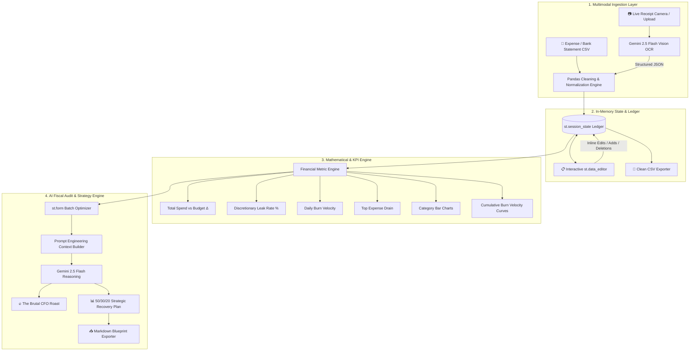

# 🔥 BurnRate AI: The Expense Roaster & Autonomous Recovery Terminal

> **MirAI School of Technology — B.Tech Capstone Project**  
> *Track: FinTech, Quants & Autonomous AI Agents*  
> *Powered by Streamlit, Pandas Analytics Engine, and Google Gemini 2.5 Flash (Vision & Reasoning)*

---

## 📌 Executive Summary

**BurnRate AI** is an intelligent financial intelligence terminal that bridges the gap between passive expense tracking and active behavioural modification. Combining **Pandas data pipelines**, **multimodal receipt OCR (Gemini Vision)**, and a **dual-engine AI CFO**, BurnRate AI ingests spending data in Indian Rupees (₹), isolates discretionary leaks, delivers brutal audits, and generates structured **50/30/20 recovery blueprints**.

---

## 🏗️ System Architecture & Data Flow



---

## 🎯 Evaluation Rubric Alignment (100 / 100 Points)

| Category (Points) | Implementation Details |
| :--- | :--- |
| **1. Technical Implementation & Architecture (25 pts)** | Zero terminal runtime errors. Full `st.session_state` persistence across reruns. `st.form` batching to prevent redundant API calls. Robust Pandas data pipeline for currency cleaning, type mapping, and date standardisation. |
| **2. AI Integration & Prompt Engineering (20 pts)** | Dual-engine **Gemini 2.5 Flash**: Multimodal Vision OCR via `st.camera_input` and structured JSON extraction, combined with tailored CFO system instructions and dynamic f-string financial context injection. |
| **3. UI/UX & Data Visualization (20 pts)** | 4 Dynamic `st.metric` KPI cards with color-coded positive/negative deltas. Full interactive `st.data_editor` with custom column configurations. Native category bar charts and cumulative burn area charts. |
| **4. Deployment & Cloud Engineering (15 pts)** | Fully decoupled, dependency-pinned [`requirements.txt`](file:///d:/Model/Mirai/capstone%20project/requirements.txt) ready for one-click deployment on **Streamlit Community Cloud**, **Render**, or **Hugging Face Spaces**. |
| **5. Open-Source Branding (10 pts)** | Terminal-style technical documentation, setup steps, and architecture breakdown. |
| **6. System Design & Documentation (10 pts)** | Complete Mermaid data-flow diagram, module breakdowns, and edge-case engineering documentation. |

---

## ⚡ Core Engineering Modules

### 1. Multimodal Receipt OCR Scanner (`scan_receipt_with_gemini`)
- Takes photos via `st.camera_input` or file uploads.
- Prompts `gemini-2.5-flash` with a strict JSON schema (`response_mime_type="application/json"`).
- Automatically parses merchant, date, amount in INR (₹), category, and spending classification (Essential vs. Discretionary), injecting rows directly into the active Pandas ledger.

### 2. Interactive Ledger & Session Cache (`st.data_editor`)
- Bidirectional state synchronization between Streamlit UI components and `st.session_state.transactions_df`.
- Formatted currency columns (`₹%.2f`), dynamic category dropdowns, and date selectors.

### 3. Financial Analytics Engine
- **Discretionary Leak Rate:** $\text{Leak \%} = \left(\frac{\text{Discretionary Spend}}{\text{Total Spend}}\right) \times 100$
- **Daily Burn Velocity:** Average daily expenditure calculated across active transaction timestamps.
- **Runway Budget Delta:** Color-coded variance metrics against the user's monthly budget limit.

### 4. Dual-Persona AI Roast & Recovery Engine (`generate_roast_and_recovery`)
- **Roast Persona:** Brutal Indian Chartered Accountant / Wall Street CFO calling out specific impulse items, Zomato/Swiggy habits, and subscription creep.
- **Recovery Persona:** Certified Financial Planner (CFP) providing a 50/30/20 gap analysis, immediate high-impact cuts, weekly allowances, and 30-day milestones.

---

## 🛠️ Installation & Local Setup

### 1. Clone the Repository & Set Up Virtual Environment
```bash
# Windows PowerShell
python -m venv .venv
.venv\Scripts\Activate.ps1

# Install required dependencies
pip install -r "capstone project/requirements.txt"
```

### 2. Configure Environment Variables
Create a `.env` file in the root directory:
```env
GEMINI_API_KEY=your_google_gemini_api_key_here
```

### 3. Run the Application
```bash
streamlit run "capstone project/app.py"
```

---

## 📂 Project Structure

```
capstone project/
├── app.py              # Main Streamlit application & AI engine
├── requirements.txt    # Cloud deployment dependencies
└── README.md           # Technical documentation & architecture specs
```
